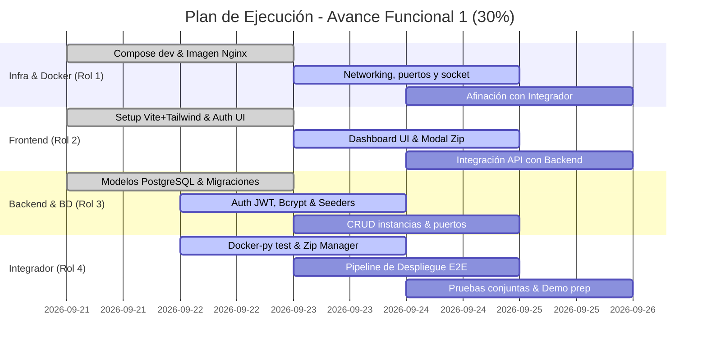

# Plan de Trabajo y Organización del Equipo: Avance Funcional 1 (30%)
**Proyecto:** Plataforma como Servicio (PaaS) – Web Hosting Service  
**Curso:** Ingeniería de Software I – Universidad Rafael Landívar  
**Hito Objetivo:** Avance Funcional 1 (30%) – *25 de septiembre de 2026*  
**Equipo:** 4 Integrantes (Rubén Espinoza, Josué González, Juan Ángel Pastor, Juan Alejandro Medina)

---

## 1. Definición del Hito del 30% ("The Walking Skeleton")

Para una evaluación universitaria con estándar de startup donde se exige **"Sistema Funcionando"**, un 30% funcional **no debe ser solo maquetas o módulos aislados**, sino un **esqueleto funcional de extremo a extremo (E2E / Tracer Bullet)**.

### ¿Qué debe demostrarse en vivo en la entrega del 30%?
1. **Flujo de Acceso:** Un usuario puede registrarse e iniciar sesión; el sistema emite un token JWT y mantiene la sesión activa en el frontend.
2. **Aprovisionamiento Real:** Desde el panel de control (React), el usuario sube un archivo `.zip` con un sitio estático básico (`index.html`, `style.css`).
3. **Ejecución Aislada:** El backend (FastAPI) extrae los archivos en el host, solicita a la API de Docker la creación de un contenedor `nginx:alpine` con el volumen montado en modo solo lectura (`:ro`) y le asigna dinámicamente un puerto libre (ej. `30001`).
4. **Acceso Web Inmediato:** El frontend muestra la tarjeta del proyecto con estado **Running** y un enlace `http://localhost:30001` que, al hacer clic, abre y renderiza el sitio web subido directamente en el navegador.
5. **Persistencia Transaccional:** La instancia, el usuario y el puerto asignado quedan registrados correctamente en la base de datos PostgreSQL.

> [!NOTE]
> **Lo que se incluye en este 30%:** Autenticación básica, estructura modular, aprovisionamiento de contenedor `nginx:alpine`, carga y descompresión de `.zip`, mapeo de puertos y dashboard inicial con tarjetas de sitios.
> 
> **Lo que se deja para fases posteriores:**
> * **Avance 2 (50%):** Ciclo de vida interactivo (Start/Stop/Restart/Destroy con limpieza de disco), telemetría en tiempo real (CPU/RAM vía WebSockets/SSE) y visor de logs Nginx.
> * **Avance 3 (80%):** Pasarela de pagos simulada (Algoritmo de Luhn), planes y control estricto de cuotas, plantillas 1-clic y panel de auditoría para el rol Administrador.

---

## 2. Asignación de Roles y Matriz de Responsabilidades

| Rol | Área de Enfoque | Responsabilidad Principal | Interacción Clave |
| :--- | :--- | :--- | :--- |
| **Rol 1: DevOps & Networking** | Docker, Nginx, Redes, Entorno | Preparar la infraestructura de contenedores, la imagen base `nginx:alpine`, políticas de red/puertos y orquestación local con Docker Compose. | Trabaja con el **Rol 4 (Integrador)** para validar el SDK de Docker y la política de volúmenes/puertos. |
| **Rol 2: Frontend & UI/UX** | React (Vite) + Tailwind CSS | Diseñar e implementar las vistas reactivas: Registro/Login, Dashboard principal, modal de subida de proyectos y tarjetas de instancias. | Consume los endpoints diseñados por el **Rol 3** y **Rol 4** mediante contratos JSON acordados. |
| **Rol 3: Backend & Database** | PostgreSQL + FastAPI (Core) | Diseñar el modelo relacional, migraciones, persistencia ACID, módulo de autenticación (JWT + Bcrypt) y endpoints base de usuarios y planes. | Provee los modelos de datos y servicios de persistencia al **Rol 4**. |
| **Rol 4: Integrador & Middleware** | FastAPI + Docker-py + File System | Construir el pegamento del sistema: recepción de archivos `.zip`, descompresión en el host, invocación del Docker Engine y coordinación de la transacción. | Conecta el trabajo del **Rol 1 (Docker/Redes)** con el **Rol 3 (BD/FastAPI)** y expone la API para el **Rol 2 (Frontend)**. |

---

## 3. Desglose de Tareas Técnicas por Rol (Hacia el 30%)

### 🛠️ Rol 1: DevOps, Redes y Contenedores (Docker Master)
* **T1.1 Entorno Unificado de Desarrollo (`docker-compose.dev.yml`):**
  * Crear compose que levante PostgreSQL 16 y una herramienta de inspección (ej. PgAdmin o CloudBeaver) para que el equipo no sufra con configuraciones locales dispares.
* **T1.2 Imagen Base de Hosting (`nginx:alpine`):**
  * Configurar y validar el archivo `nginx.conf` estándar mínimo para las instancias de hosting (directivas de caché, desactivación de directivas inseguras, root en `/usr/share/nginx/html`).
  * Comprobar que la imagen cumpla con **RNF-02** (consumo en reposo < 10 MB RAM y tamaño < 25 MB).
* **T1.3 Estrategia de Networking y Puertos:**
  * Definir la convención de red de Docker (red tipo bridge) para aislar las instancias de los contenedores de la plataforma.
  * Validar con pruebas manuales el comando Docker equivalente para asegurar que el montaje en modo lectura funciona estrictamente:
    `docker run -d -p 30001:80 -v /srv/hosting/instancias/demo:/usr/share/nginx/html:ro --name test-instance nginx:alpine`
* **T1.4 Conectividad Docker Socket:**
  * Configurar y documentar los permisos de acceso al socket `/var/run/docker.sock` (o el canal de Docker Desktop en Windows) para que la aplicación FastAPI pueda comunicarse con el daemon sin restricciones.

---

### 💻 Rol 2: Frontend & Experiencia de Usuario (UI/UX)
* **T2.1 Configuración de la SPA:**
  * Inicializar el proyecto con Vite + React + Tailwind CSS + Lucide Icons.
  * Establecer la paleta de colores y componentes base siguiendo la estética de una startup de nube moderna (modo oscuro/claro sobrio, tipografía Inter).
* **T2.2 Vistas de Autenticación (RF-01, RF-03):**
  * Pantalla de Login (correo y contraseña) con validación de formularios y almacenamiento del token JWT en `localStorage` o cookies.
  * Pantalla de Registro de cuenta con validaciones sintácticas.
* **T2.3 Dashboard Principal (PaaS Console):**
  * Layout responsivo con barra lateral/superior, estado del usuario y botón de cerrar sesión (RF-04).
  * Vista de lista/cuadrícula de proyectos con tarjetas informativas:
    * Nombre de la instancia.
    * Estado visual tipo badge (verde para *Running*, gris para *Stopped*).
    * Enlace directo clickable (`http://localhost:PUERTO`) que se abre en nueva pestaña (RF-19).
    * Fecha de creación.
* **T2.4 Modal de Nuevo Despliegue (Deploy Modal):**
  * Formulario con input de texto para el nombre del proyecto y zona drag-and-drop para cargar el archivo `.zip`.
  * Barra de progreso simulada o spinner de estado ("Subiendo artefacto...", "Aprovisionando contenedor...", "¡Sitio en línea!").

---

### 🗄️ Rol 3: Backend & Arquitectura de Base de Datos
* **T3.1 Diseño y Modelado Relacional (PostgreSQL):**
  * Configurar SQLAlchemy (o SQLModel) y Alembic para migraciones automáticas.
  * Crear modelos base:
    * `User`: `id`, `email`, `password_hash`, `full_name`, `role` (Admin/Cliente), `is_active`, `created_at`.
    * `Plan`: `id`, `name` (Free, Developer, Pro), `max_instances`, `max_ram_mb`, `cpu_quota`, `price`.
    * `Subscription`: `id`, `user_id`, `plan_id`, `status` (Active), `start_date`, `end_date`.
    * `Instance`: `id`, `user_id`, `name`, `container_id`, `assigned_port`, `status` (created, running, stopped), `subdomain`, `created_at`.
    * `PortAllocation`: `port_number` (30001 a 30100), `is_busy`, `instance_id`.
* **T3.2 Seeders de Base de Datos:**
  * Script inicial para sembrar los 3 planes obligatorios (RF-07) y poblar la tabla de puertos disponibles del 30001 al 30100 (RF-18).
* **T3.3 Módulo de Autenticación y Criptografía (AuthService):**
  * Implementar hashing seguro de contraseñas con `bcrypt` (factor de costo 12) según **RNF-06**.
  * Generación y verificación de tokens JWT firmados con algoritmo HS256 (`access_token`, exp: 24h).
  * Dependencia de FastAPI `get_current_user` para proteger rutas mediante header `Authorization: Bearer <token>`.
* **T3.4 Endpoints de Auth:**
  * `POST /api/v1/auth/register` (RF-01).
  * `POST /api/v1/auth/login` (RF-03).
  * `GET /api/v1/auth/me` (perfil y cuota actual del usuario).

---

### ⚙️ Rol 4: Integrador, Middleware & Orquestación Docker
* **T4.1 Módulo `ArtifactManager` (Carga y Descompresión segura):**
  * Endpoint `POST /api/v1/instances/deploy` que recibe `UploadFile (.zip)` y metadatos del proyecto.
  * Implementación de protección contra **Zip Slip Attack (RNF-05)**: verificar que ninguna ruta relativa descomprimida contenga `../` o intente escapar del directorio asignado.
  * Almacenamiento en estructura por inquilino:
    `/srv/hosting/instancias/<user_id>_<app_id>/` (o carpeta análoga dentro del workspace).
* **T4.2 Módulo `PortManager`:**
  * Lógica para consultar en la base de datos (concurrencia segura o `SELECT ... FOR UPDATE`) el siguiente puerto libre en el rango 30001-30100 y reservarlo.
* **T4.3 Módulo `DockerOrchestrator`:**
  * Integrar la librería oficial `docker-py` con conexión al socket del host.
  * Método `create_web_instance(instance_name, user_id, host_port, project_path)`:
    * Ejecutar contenedor a partir de `nginx:alpine`.
    * Mapeo de puerto: `{'80/tcp': host_port}`.
    * Montaje de volumen: `{project_path: {'bind': '/usr/share/nginx/html', 'mode': 'ro'}}` (RNF-04).
    * Asignar límites preliminares de memoria (ej. `mem_limit="128m"`).
    * Devolver el `container.id` y `container.short_id`.
* **T4.4 Orquestación del Flujo Completo y Unificación:**
  * Coordinar en el endpoint de despliegue la secuencia transaccional:
    1. Validar token JWT (Rol 3).
    2. Validar que no exceda cuota básica (1 instancia en Free).
    3. Reservar puerto libre (Rol 3/4).
    4. Guardar y descomprimir `.zip` (Rol 4).
    5. Disparar creación de contenedor Docker (Rol 1/4).
    6. Persistir registro en PostgreSQL con estado `running` (Rol 3).
    7. Retornar payload unificado al Frontend (Rol 2).
* **T4.5 Documentación de Contratos API:**
  * Mantener al día la documentación interactiva OpenAPI/Swagger (`/docs`) para que el desarrollador Frontend pueda probar y consumir endpoints sin fricción.

---

## 4. Contrato de Integración Clave (API Interface)

Para que el **Frontend (Rol 2)** y el **Backend (Roles 3 y 4)** avancen en paralelo sin bloquearse desde el primer día, se establece este contrato inicial:

### `POST /api/v1/instances/deploy`
* **Headers:** `Authorization: Bearer <token>`, `Content-Type: multipart/form-data`
* **Body:**
  * `name`: string (ej. `"Mi Portafolio"`)
  * `file`: Archivo binario `.zip`
* **Response (HTTP 201 Created):**
```json
{
  "id": "inst_9b1deb4d3b7d4bf9",
  "name": "Mi Portafolio",
  "status": "running",
  "assigned_port": 30001,
  "public_url": "http://localhost:30001",
  "container_id": "7f8b9a1c2d3e",
  "created_at": "2026-09-25T10:30:00Z"
}
```

### `GET /api/v1/instances`
* **Headers:** `Authorization: Bearer <token>`
* **Response (HTTP 200 OK):**
```json
[
  {
    "id": "inst_9b1deb4d3b7d4bf9",
    "name": "Mi Portafolio",
    "status": "running",
    "assigned_port": 30001,
    "public_url": "http://localhost:30001",
    "created_at": "2026-09-25T10:30:00Z"
  }
]
```

---

## 5. Cronograma Táctico de Ejecución (Día a Día)



---

## 6. Criterios de Aceptación / Checklist para la Demo (Definition of Done)

Antes de presentar el avance ante el docente, el equipo debe verificar la siguiente lista de comprobación:

- [ ] **Docker Engine activo:** El daemon de Docker responde sin errores y la imagen `nginx:alpine` está precargada localmente.
- [ ] **Registro e Inicio de Sesión:** Un usuario nuevo puede registrarse en la BD y loguearse, recibiendo su token JWT.
- [ ] **Carga de Paquete Web:** Se puede seleccionar un archivo `.zip` real desde la interfaz web (ej. una plantilla HTML5 o sitio estático simple).
- [ ] **Contenedor Creado y Corriendo:** Al completar la subida, `docker ps` en la terminal del servidor muestra el nuevo contenedor con la imagen `nginx:alpine` y los puertos mapeados (ej. `0.0.0.0:30001->80/tcp`).
- [ ] **Visualización Web:** Al hacer clic en el enlace generado en el frontend, el navegador muestra la página web estática con sus estilos e imágenes sin error 404/500.
- [ ] **Aislamiento Básico:** Se comprueba que el volumen montado está en modo solo lectura (`:ro`).
- [ ] **Defensa de Arquitectura:** Cada integrante domina su componente y puede explicar el flujo de datos desde la llamada React hasta la creación del contenedor en el kernel de Linux.
