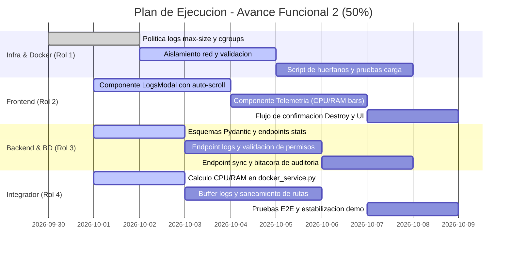

# Plan de Trabajo y Organizacion del Equipo: Avance Funcional 2 (50%)
**Proyecto:** Plataforma como Servicio (PaaS) – Web Hosting Service  

**Hito Objetivo:** Avance Funcional 2 (50%) – 9 de octubre de 2026  


---

## 1. Definicion del Hito del 50% (Consolidacion del Core, Ciclo de Vida y Observabilidad)

El objetivo del hito del 50% es transformar el prototipo inicial en un producto minimo viable (MVP) completamente interactivo, resiliente y observable. Mientras que en el 30% se logro el flujo basico de despliegue, en el 50% el usuario debe tener control total sobre sus instancias, visibilidad del estado real del servidor y proteccion estricta de recursos.

### Lo que debe demostrarse en vivo en la entrega del 50%
1. **Control de Ciclo de Vida en Vivo (RF-16, RF-17):**
   * Detener (*Stop*), reiniciar (*Restart*) e iniciar (*Start*) un contenedor desde la interfaz web, con actualizacion visual inmediata de estados (*Running*, *Stopped*, *Transitioning*).
   * Eliminacion definitiva (*Destroy*): confirmacion previa, detencion del contenedor, liberacion del puerto TCP en el pool de base de datos y eliminacion fisica de los archivos en disco del host (`storage_path`).
2. **Observabilidad y Telemetria Basica (RF-20):**
   * Obtencion de metricas de uso en tiempo real por instancia: porcentaje de uso de CPU y consumo de memoria RAM (en MB y % relativo al limite cgroup del plan).
3. **Visor de Logs del Servidor Web (RF-21):**
   * Consola integrada en el frontend para inspeccionar las ultimas 100 lineas de salida de Nginx (*access.log* y *error.log* capturados de *stdout/stderr* del contenedor).
4. **Sincronizacion y Resiliencia de Estado (Docker vs BD):**
   * Si un contenedor se detiene externamente o falla, la plataforma detecta la discrepancia y sincroniza el estado en la base de datos sin quedar bloqueada.
5. **Enforzamiento de Cuotas y Seguridad Reforzada (RF-12, RNF-04, RNF-05):**
   * Bloqueo estricto si el usuario alcanza el limite de sitios de su plan.
   * Aislamiento estricto de red y verificacion de que el volumen Nginx se mantiene en solo lectura (`:ro`).

> [!NOTE]
> **Alcance de este 50%:** Control de ciclo de vida completo (Start/Stop/Restart/Destroy), liberacion garantizada de recursos (puertos y disco), telemetria de CPU/RAM, visor de logs en consola web y reconciliacion de estado Docker-BD.
>
> **Lo que se reserva para el Hito del 80%:**
> * Pasarela de pago simulada con algoritmo de Luhn (RF-09).
> * Upgrade y downgrade de suscripciones (RF-11).
> * Plantillas rapidas de despliegue en un clic (RF-14).
> * Panel de auditoria global para el rol Administrador (RF-22, RF-23).

---

## 2. Asignacion de Roles y Matriz de Responsabilidades

| Rol | Area de Enfoque | Responsabilidad Principal en el 50% | Interaccion Clave |
| :--- | :--- | :--- | :--- |
| **Rol 1: DevOps & Networking** | Docker Engine, Cgroups, Logging, Politicas de Red | Configurar limites duros de recursos (CPU quota y memory swap), politicas de retencion de logs de Docker, red aislada por instancia y pruebas de carga local. | Provee al **Rol 4** la configuracion correcta de lectura de streams de logs y estadisticas de Docker. |
| **Rol 2: Frontend & UI/UX** | React 18, Tailwind CSS, Componentes Interactivos | Construir los controles de ciclo de vida, modal/consola de logs con auto-scroll, widgets de telemetria (CPU/RAM) y estados de carga no bloqueantes. | Consume los endpoints de metricas, logs y acciones implementados por el **Rol 3** y **Rol 4**. |
| **Rol 3: Backend & Database** | FastAPI Core, PostgreSQL, Auditoria, Transacciones | Implementar endpoints de telemetria, logs y auditoria; asegurar transacciones ACID en la liberacion de puertos y eliminacion fisica de registros. | Suministra los modelos de persistencia y esquemas Pydantic para el **Rol 4** y endpoints para el **Rol 2**. |
| **Rol 4: Integrador & Middleware** | FastAPI, SDK Docker-py, Telemetria, Sistema de Archivos | Desarrollar metodos de extraccion de estadisticas de Docker (`stats`), lectura de buffer de logs (`logs`), saneamiento de rutas y recuperacion ante fallos. | Conecta el daemon de Docker del **Rol 1** con la base de datos del **Rol 3** y la interfaz del **Rol 2**. |

---

## 3. Desglose de Tareas Tecnicas por Rol (Hacia el 50%)

### Rol 1: DevOps, Redes y Contenedores (Docker Master)
* **T1.1 Configuracion de Retencion de Logs en Contenedores (RF-21):**
  * Configurar en el orquestador opciones de log driver de Docker (`json-file`) con limites maximos (`max-size: 5m`, `max-file: 2`) para evitar que logs excesivos de Nginx agoten el espacio en disco del host.
  * Archivo de referencia: [docker_service.py](file:///home/rtdash/Proyectos/Software/servidor_servicio/web-hosting/backend/app/services/docker_service.py).
* **T1.2 Verificacion y Ajuste de Cgroups (RNF-02, RF-15):**
  * Validar que los parametros de limites (`mem_limit`, `memswap_limit`, `nano_cpus`) apliquen correctamente segun el plan del usuario (Free: 128 MB RAM, 0.25 CPU; Developer: 256 MB RAM, 0.50 CPU; Pro: 512 MB RAM, 1.0 CPU).
  * Crear un script en `infra/scripts/test_resource_limits.sh` para verificar con `docker stats` que el contenedor no sobrepase su cgroup asignado.
* **T1.3 Aislamiento de Red y Politica de Seguridad (RNF-04, RNF-07):**
  * Garantizar la creacion y persistencia de la red de puente dedicada `paas_instances_network`.
  * Comprobar que los contenedores de hosting no puedan acceder a la red interna donde residen PostgreSQL y FastAPI, impidiendo cualquier acceso horizontal.
* **T1.4 Script de Mantenimiento y Deteccion de Contenedores Huerfanos:**
  * Crear un script de diagnostico `infra/scripts/cleanup_orphans.py` que compare los contenedores activos etiquetados con `managed_by=cloudpaas` contra los registros en la base de datos y reporte discrepancias.

---

### Rol 2: Frontend & Experiencia de Usuario (UI/UX)
* **T2.1 Consola de Logs Integrada (RF-21):**
  * Crear componente `src/components/InstanceLogsModal.jsx` que muestre una ventana estilo terminal oscura (monospaced) con las ultimas 100 lineas de log.
  * Incluir boton de refrescar logs, boton de copiar al portapapeles, interruptor de auto-scroll y selector de vista (*Todo*, *Acceso*, *Errores*).
* **T2.2 Panel de Telemetria de Recursos en Tiempo Real (RF-20):**
  * Crear componente `src/components/InstanceMetricsCard.jsx` o integrarlo en la tarjeta existente en [DashboardPage.jsx](file:///home/rtdash/Proyectos/Software/servidor_servicio/web-hosting/frontend/src/pages/DashboardPage.jsx).
  * Mostrar barras de progreso visuales con codigo de colores:
    * CPU: Porcentaje actual (0 a 100%).
    * RAM: Consumo actual en MB respecto al maximo asignado (ej. `8.4 MB / 128 MB`).
    * Estado de color: verde (< 70%), amarillo (70-90%), rojo (> 90%).
* **T2.3 Refuerzo de Controles de Ciclo de Vida y Estados Transicionales (RF-16, RF-17):**
  * Mejorar el manejo de estados en `handleAction` y `handleDestroy`.
  * Mostrar spinner y deshabilitar botones mientras la accion este en progreso (estados: `starting`, `stopping`, `destroying`).
  * Modal de confirmacion destructiva estilizado para `Destroy` indicando que se perderan los datos en disco.
* **T2.4 Integracion con Cliente API:**
  * Extender [api.js](file:///home/rtdash/Proyectos/Software/servidor_servicio/web-hosting/frontend/src/services/api.js) con las funciones:
    * `instanceService.getLogs(instanceId, tail = 100)`
    * `instanceService.getMetrics(instanceId)`
    * `instanceService.syncStatus(instanceId)`

---

### Rol 3: Backend & Arquitectura de Base de Datos
* **T3.1 Endpoints de Observabilidad en FastAPI:**
  * `GET /api/v1/instances/{id}/logs`: Valida pertenencia de la instancia y retorna las lineas de log formateadas.
  * `GET /api/v1/instances/{id}/metrics`: Retorna CPU %, RAM en MB, limite de RAM y timestamp actual.
  * Archivo objetivo: [instances.py](file:///home/rtdash/Proyectos/Software/servidor_servicio/web-hosting/backend/app/api/v1/instances.py).
* **T3.2 Esquemas Pydantic de Respuesta de Telemetria:**
  * En [instance_schema.py](file:///home/rtdash/Proyectos/Software/servidor_servicio/web-hosting/backend/app/schemas/instance_schema.py), definir:
    * `InstanceLogsResponse`: `container_id`, `lines` (List[str]), `total_lines`.
    * `InstanceMetricsResponse`: `instance_id`, `cpu_percent`, `memory_usage_mb`, `memory_limit_mb`, `memory_percent`, `status`.
* **T3.3 Endpoint de Sincronizacion y Reconciliacion:**
  * `POST /api/v1/instances/{id}/sync`: Comprueba el estado real del contenedor en Docker Engine (`running`, `exited`, `not_found`) y actualiza el campo `status` en la base de datos si difiere.
* **T3.4 Bitacora Basica de Auditoria de Acciones:**
  * Registrar en logs estructurados cada operacion de ciclo de vida con formato:
    `[ACTION_AUDIT] user_id={user_id} instance_id={instance_id} action={action} result={success|failed}`.

---

### Rol 4: Integrador, Middleware & Orquestacion Docker
* **T4.1 Extraccion de Estadisticas de Docker (`get_container_stats`):**
  * Implementar en [docker_service.py](file:///home/rtdash/Proyectos/Software/servidor_servicio/web-hosting/backend/app/services/docker_service.py) el metodo para leer `container.stats(stream=False)`.
  * Calcular con exactitud:
    * Formula CPU%: `(cpu_delta / system_cpu_delta) * number_cpus * 100.0`.
    * Formula Memoria: `usage - cache` (o `stats['memory_stats']['usage'] / (1024 * 1024)`).
  * Retornar valores por defecto seguros (0% y 0 MB) si el contenedor se encuentra detenido (*stopped*).
* **T4.2 Captura de Logs de Nginx (`get_container_logs`):**
  * Implementar en [docker_service.py](file:///home/rtdash/Proyectos/Software/servidor_servicio/web-hosting/backend/app/services/docker_service.py) el metodo para extraer los ultimos `tail` registros con decodificacion UTF-8 segura (`container.logs(tail=tail, timestamps=True)`).
* **T4.3 Manejo Robusto de Excepciones Docker:**
  * Manejar `docker.errors.NotFound` en todas las acciones para evitar respuestas 500 no controladas cuando un contenedor fue borrado fuera de la aplicacion.
  * Devolver codigos HTTP 404 limpios con descripcion en espanol.
* **T4.4 Limpieza Segura en Eliminacion (*Destroy*):**
  * Validar en [instances.py](file:///home/rtdash/Proyectos/Software/servidor_servicio/web-hosting/backend/app/api/v1/instances.py) que la eliminacion de disco ocurra estrictamente dentro del prefijo `settings.RESOLVED_STORAGE_PATH` antes de invocar `shutil.rmtree`, previniendo manipulacion de rutas.

---

## 4. Contrato de Integracion Clave (API Interface)

Este contrato detalla las rutas necesarias para el hito del 50%. Debe respetarse estrictamente para permitir que el Frontend y el Backend avancen de forma sincronizada.

### 4.1 `GET /api/v1/instances/{id}/metrics`
* **Headers:** `Authorization: Bearer <token>`
* **Codigos de Respuesta:** `200 OK`, `403 Forbidden`, `404 Not Found`
* **Payload de Respuesta (HTTP 200):**
```json
{
  "instance_id": 1,
  "status": "running",
  "cpu_percent": 1.25,
  "memory_usage_mb": 7.82,
  "memory_limit_mb": 128.0,
  "memory_percent": 6.11,
  "updated_at": "2026-10-02T14:30:00Z"
}
```

### 4.2 `GET /api/v1/instances/{id}/logs`
* **Headers:** `Authorization: Bearer <token>`
* **Parametros Query:** `tail=100` (opcional, entero, defecto 100)
* **Codigos de Respuesta:** `200 OK`, `403 Forbidden`, `404 Not Found`
* **Payload de Respuesta (HTTP 200):**
```json
{
  "instance_id": 1,
  "container_id": "7f8b9a1c2d3e",
  "total_lines": 3,
  "lines": [
    "2026-10-02T14:28:10Z 127.0.0.1 - [02/Oct/2026:14:28:10 +0000] \"GET / HTTP/1.1\" 200 615 \"-\" \"Mozilla/5.0\"",
    "2026-10-02T14:28:11Z 127.0.0.1 - [02/Oct/2026:14:28:11 +0000] \"GET /style.css HTTP/1.1\" 200 1230 \"-\" \"Mozilla/5.0\"",
    "2026-10-02T14:29:05Z [error] 29#29: *1 open() \"/usr/share/nginx/html/favicon.ico\" failed (2: No such file or directory)"
  ]
}
```

### 4.3 `POST /api/v1/instances/{id}/action`
* **Headers:** `Authorization: Bearer <token>`, `Content-Type: application/json`
* **Body:**
```json
{
  "action": "stop"
}
```
*Valores permitidos de `action`: `"start"`, `"stop"`, `"restart"`.*
* **Payload de Respuesta (HTTP 200):**
```json
{
  "message": "Instancia stop ejecutada exitosamente.",
  "status": "stopped"
}
```

### 4.4 `DELETE /api/v1/instances/{id}`
* **Headers:** `Authorization: Bearer <token>`
* **Payload de Respuesta (HTTP 200):**
```json
{
  "message": "Instancia destruida, puerto liberado y almacenamiento limpiado correctamente.",
  "instance_id": 1
}
```

### 4.5 `POST /api/v1/instances/{id}/sync`
* **Headers:** `Authorization: Bearer <token>`
* **Payload de Respuesta (HTTP 200):**
```json
{
  "instance_id": 1,
  "previous_status": "running",
  "current_status": "stopped",
  "synced": true
}
```

---

## 5. Cronograma Tactico de Ejecucion (Mermaid)



---

## 6. Criterios de Aceptacion para la Demo del 50% (Definition of Done)

Para considerar completado el Hito del 50% y presentarlo en evaluacion, deben cumplirse las siguientes condiciones:

- [ ] **Ciclo de Vida Operativo:** Al presionar *Stop*, el contenedor se detiene en Docker (`docker ps` no lo lista como Up), la URL deja de responder y el badge cambia a `Stopped`. Al presionar *Start*, se reactiva inmediatamente.
- [ ] **Reinicio sin Perdida:** La opcion *Restart* reinicia el proceso del contenedor sin cambiar el puerto asignado ni alterar los archivos del sitio.
- [ ] **Eliminacion Completa y Limpia:** Al pulsar *Destroy*, el contenedor es removido de Docker, el puerto asignado queda libre en la tabla `port_allocations` para futuros despliegues, y el directorio en el host es eliminado.
- [ ] **Telemetria Funcional:** Al solicitar metricas de una instancia activa, el sistema retorna el consumo de CPU (%) y RAM (MB) obtenido de la API de Docker y se visualiza en la interfaz. Si la instancia esta apagada, marca 0% y 0 MB.
- [ ] **Visor de Logs en Vivo:** Al abrir el visor de logs, se observan las peticiones HTTP que recibe el sitio y los errores 404 generados en tiempo real.
- [ ] **Manejo de Contenedores Inexistentes:** Si un contenedor se elimina manualmente con la terminal (`docker rm -f`), la plataforma maneja el error con elegancia, permitiendo sincronizar el estado o destruir el registro sin que el sistema falle.
- [ ] **Verificacion de Cuota:** Un usuario con plan *Free* no puede tener mas de 1 instancia activa de forma simultanea; cualquier intento adicional responde HTTP 403 con mensaje explicativo en la interfaz.
